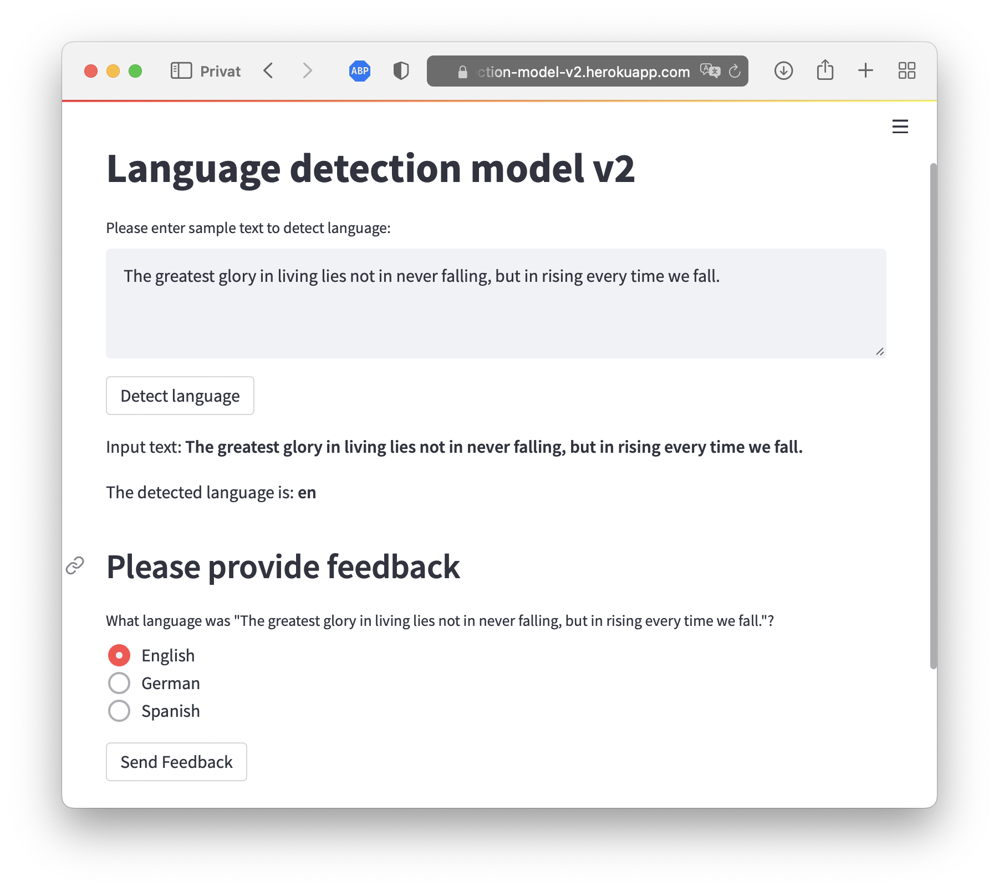

# language-detection-model-v2

A simple web app, which classifies user input into english, german or spanish. The modell is trained a scraped data from eg. wikipedia, but also relies on the user feedback.



You can try it out here: [language-detection-model-v2](https://language-detection-model-v2.herokuapp.com)


###### Initial repository: https://gitlab.com/smba/language-detection-model


## Overview
The app consists of three main parts:
- app
- api
- training pipeline

### app
The _app_ is a [streamlit](https://streamlit.io) application which receives the user input and predicts the language.

### api
The _api_ is a flask server which receives and stores the user feedback. The feedback is stored in a CSV file and uses telegram in a creative way to store the file for free ~~real estate~~ storage.

It has three exposed endpoints:
- /add
- /view
- /download

**/add** Lets you add a new entry to the CSV storage, and requires two paramters, _text_ and _label_ (label should be one of ["en", "de", "es"]):

`http:.../add?text=Jonas%20is%20nice&label=en`

**/view** displayes the content of the data.

**/download** downloads the stored CSV file. 

### training pipeline
The _training pipeline_ uses the labeled data from the user, training data from [huggingface](https://huggingface.co/datasets/papluca/language-identification) and scraped data from wikipedia to train the language-detection-model.


## Development
### Run development locally
```bash
python3 -m venv venv # python>3.8
pip install -r requirements.txt

## Run api
cd app
streamlit run app.py

## Run api
cd api
python api.py

## Run pipeline
TODO: ...

```
### Run container locally
```bash
## Run app
docker build -f Dockerfile-local .  -t ldm-app 
docker run -it -p 8501:8501 ldm-app

## Run api
docker image build -t ldm-api .
# a special env file is needed with the access tokens for telegam, else it abviously won't run locally
docker run -p 5055:5055 -d --env-file=env ldm-api
```

## Deployment
A github action deploys the api and app to heroku.

For the training and scraping, a docker image can be built with:

```sh
docker build -t ldm-v2-training ./training
```

### Scraping

New training data can be scraped from wikipedia with:

```sh
docker run -v $(pwd)/training/data:/training/data -it ldm-v2-training /training/scrape_wikipedia.py
```

### Training

By running the training pipeline the current user feedback will be fetched, added to the training/test/validation data and the model retrained. After the training, the model will be pushed to the main branch, which will trigger the github action and deploy the newly trained model to heroku. The training pipeline can be run from the git repository with:

```sh
docker run -v $(pwd):/repository -v ~/.gitconfig:/etc/gitconfig --workdir /repository -it ldm-v2-training training/train_and_commit.sh
```

(note that this needs access to your git config in order to pull recent changes, and commit and push the new model)